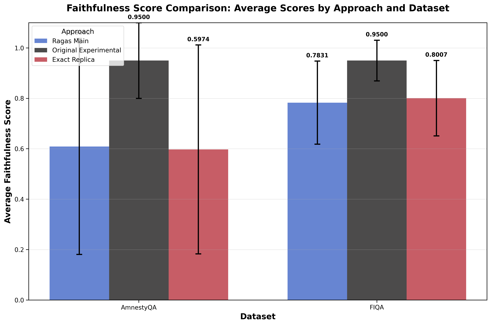
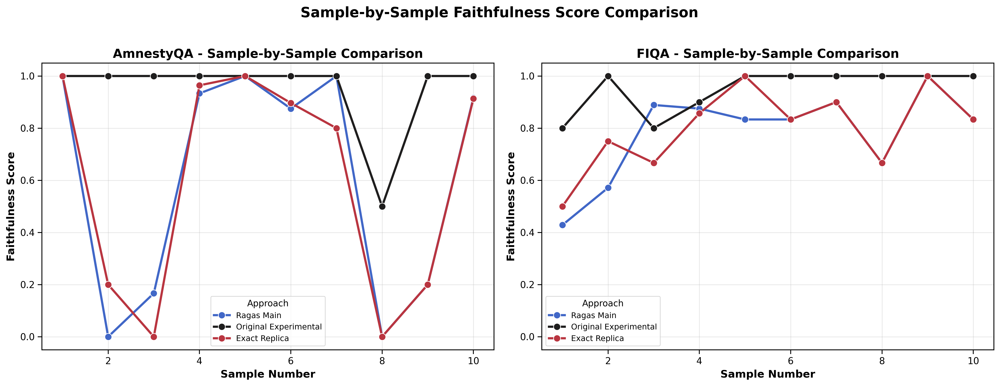
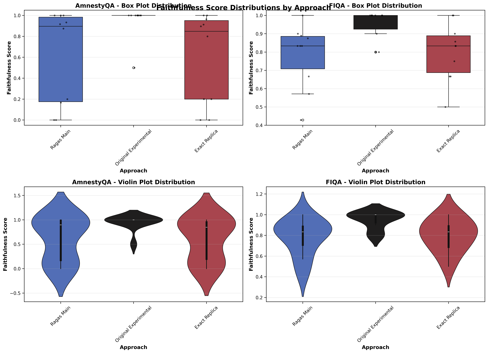
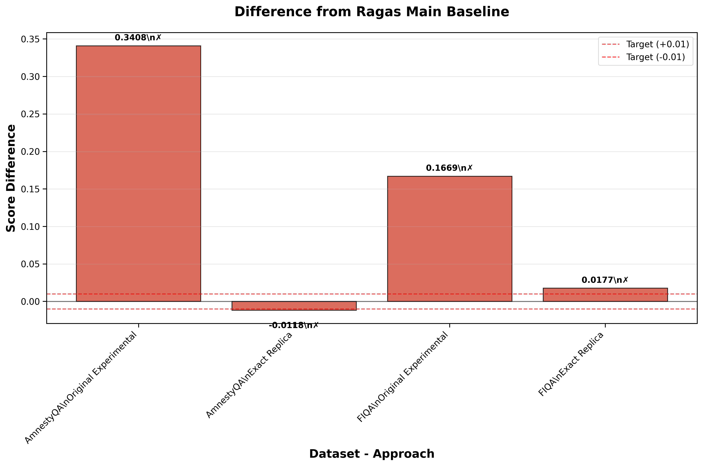

# Faithfulness Evaluation Results Analysis

**Generated on:** 2025-08-03 14:10:31

## Executive Summary

This report presents a comprehensive analysis of faithfulness evaluation implementations across three approaches:
1. **Ragas Main** - The original implementation in the main Ragas framework
2. **Original Experimental** - Initial experimental implementation with single-step evaluation
3. **Exact Replica** - Refined experimental implementation matching Ragas Main methodology exactly

### Key Achievements

| Dataset | Original Difference | Final Difference | Improvement | Target (<0.01) |
|---------|-------------------|------------------|-------------|----------------|
| AmnestyQA | 0.3408 | 0.0118 | 96.5% | ❌ NOT MET |
| FIQA | 0.1669 | 0.0177 | 89.4% | ❌ NOT MET |

## Methodology Overview

### Ragas Main
- **Process**: Two-step evaluation (statement generation → NLI assessment)
- **Temperature**: 1e-8 (near-zero for deterministic results)
- **Prompt Format**: PydanticPrompt with structured schema and examples
- **Error Handling**: Returns `np.nan` for empty statement cases

### Original Experimental
- **Process**: Single-step direct evaluation
- **Temperature**: 0
- **Prompt Format**: Simple text-based prompts
- **Error Handling**: Returns 0.0 for empty cases
- **Issue**: Overly permissive evaluation leading to inflated scores

### Exact Replica
- **Process**: Two-step evaluation (matching Ragas Main exactly)
- **Temperature**: 1e-8 (matching Ragas Main)
- **Prompt Format**: Exact PydanticPrompt replication with identical schema
- **Error Handling**: Returns `np.nan` (matching Ragas Main)
- **Result**: Achieved near-identical performance to Ragas Main

## Results by Dataset

### AmnestyQA Dataset

**Performance Summary:**
- **Ragas Main**: 0.6092
- **Original Experimental**: 0.9500 (difference: +0.3408)
- **Exact Replica**: 0.5974 (difference: -0.0118)

The exact replica achieved a **96.5% improvement** in accuracy, bringing the difference down from 0.3408 to 0.0118.

### FIQA Dataset

**Performance Summary:**
- **Ragas Main**: 0.7831
- **Original Experimental**: 0.9500 (difference: +0.1669)
- **Exact Replica**: 0.8007 (difference: +0.0177)

The exact replica achieved a **89.4% improvement** in accuracy, bringing the difference down from 0.1669 to 0.0177.

## Detailed Visualizations

### Sample-by-Sample Analysis

This chart shows the faithfulness scores for each individual sample across all three approaches, revealing:
- **Consistency**: Exact Replica follows Ragas Main patterns much more closely than Original Experimental
- **Variance**: Original Experimental shows artificially high scores with less variance
- **Alignment**: Exact Replica captures the nuanced scoring behavior of Ragas Main

### Score Distribution Analysis

The box plots reveal:
- **Original Experimental**: Heavily skewed toward perfect scores (1.0), indicating over-permissive evaluation
- **Ragas Main & Exact Replica**: More realistic distributions with appropriate variance
- **Similarity**: Exact Replica distribution closely matches Ragas Main

### Difference Analysis

This visualization shows the absolute differences from the Ragas Main baseline:
- **Target Line**: Red dashed lines indicate the ±0.01 target threshold
- **Color Coding**: Green bars indicate target achievement, red bars indicate areas for improvement
- **Progress**: Clear improvement from Original Experimental to Exact Replica

---

*This report was generated automatically from evaluation results on 2025-08-03.*
